# LifeLink Comprehensive System Flowchart

This document provides a detailed visual map of the LifeLink platform's features and user journeys.

## Complete System Flow

```mermaid
graph TD
    Start([Start Application]) --> Splash[Splash / Landing Screen]
    Splash --> AuthMode{Is Logged In?}
    
    %% AUTHENTICATION FLOW
    AuthMode -- No --> Login[Login Page]
    Login --> ForgotPass[Forgot Password?]
    ForgotPass --> RequestCode[Request Reset Code]
    RequestCode --> VerifyCode[Verify Code]
    VerifyCode --> ResetPass[Reset Password]
    ResetPass --> Login
    
    Login --> Register[Register Page]
    Register --> RoleSel{Select Role}
    RoleSel -- Donor/Patient --> RegUser[Register as User]
    RoleSel -- Hospital --> RegHosp[Register as Hospital]
    RoleSel -- Admin --> RegAdmin[Pre-created Admin]
    RegUser & RegHosp --> Login
    
    %% MAIN NAVIGATION (HOME)
    AuthMode -- Yes --> Home[Home Page / Dashboard]
    
    subgraph "Navigation & Global Features"
        Home --> LangSwitch[Language Toggle: EN / NP]
        Home --> Notifs[Notifications: Alerts, Messages, Requests]
        Home --> ChatAI[LifeLink AI Chatbot]
        Home --> GlobalChat[Personal Messaging Center]
    end

    %% CORE WORKFLOWS
    subgraph "Core Functionalities"
        Home --> FindDonors[Find Donors Page]
        FindDonors --> Search[Filter by Location/Blood Type]
        Search --> MapView[View Map Markers]
        MapView --> DonorProf[View Donor Profile]
        DonorProf --> TextDonor[Start Personal Chat]
        
        Home --> RequestHelp[Request Help Page / Modal]
        RequestHelp --> ReqForm[Fill Requirement: Blood/Organ]
        ReqForm --> Urgency{Urgency Level?}
        Urgency -- Emergency --> Broadcast[Immediate Area Broadcast]
        Urgency -- Standard --> PostReq[Post to Active Requests]
        Broadcast & PostReq --> ReqDetail[Help Request Detail View]
    end

    %% PROFILE & SETTINGS
    subgraph "User Management"
        Home --> Profile[My Profile]
        Profile --> EditProf[Update Personal Info]
        Profile --> Preferences[Donation Preferences: Blood/Organ]
        Profile --> KYC[KYC Verification Status]
        KYC -- Not Verified --> SubmitKYC[Submit Documents]
        SubmitKYC --> Pending[Status: Pending Review]
    end

    %% ADMIN & HOSPITAL PANELS
    subgraph "Administrative Control"
        Home --> RoleCheck{User Role?}
        RoleCheck -- Admin --> AdminPanel[Admin Dashboard]
        AdminPanel --> KYCReview[KYC User Review]
        KYCReview -- Approve --> Verified[Mark User: Verified]
        KYCReview -- Reject --> NotifyUser[Notify User / Request Update]
        AdminPanel --> Reports[Donation & Request Reports]
        AdminPanel --> ManageApps[Global Announcements]
        
        RoleCheck -- Hospital --> HospPanel[Hospital Dashboard]
        HospPanel --> LocalReqs[In-Area Active Requests]
        HospPanel --> Facilitated[Completed Donations Tracking]
        HospPanel --> HospCampaigns[Create Health Campaigns]
    end

    %% TERMINALS
    Verified & NotifyUser --> AdminPanel
    ReqDetail --> End([Flow Complete / Interaction Point])
    TextDonor --> GlobalChat
    End --> Home
```

## Key Modules Description

### 1. Identity & Access
The entry point supports role-based access control (RBAC). Users identify as **Donors/Patients**, **Hospitals**, or **Admins** at registration. The system includes a secure JWT-based login and a multi-step password recovery mechanism.

### 2. The Command Center (Home Page)
The Home Page acts as a dynamic hub featuring:
*   **Real-time Stats**: Active requests, total donors, and district reach.
*   **Global Overlays**: An AI-powered chatbot for instant inquiries and a notification engine for urgent broadcasts.
*   **Localization**: Instant UI switching between English and Nepali.

### 3. Donor Discovery
Users can find donors through a specialized interface that combines search filters with a geographic map. Verified donor profiles allow direct communication via the integrated messaging system.

### 4. Emergency & Standard Requests
*   **Emergency Path**: Bypasses standard queues to broadcast alerts to nearby matching donors.
*   **Standard Path**: Lists requests in the community feed for voluntary response.

### 5. Institutional & Admin Panels
*   **Admin**: Responsible for the "Trust Layer" by reviewing KYC submissions and managing global platform announcements.
*   **Hospital**: Focuses on local area impact, tracking donations facilitated through their facility and organizing health campaigns.
