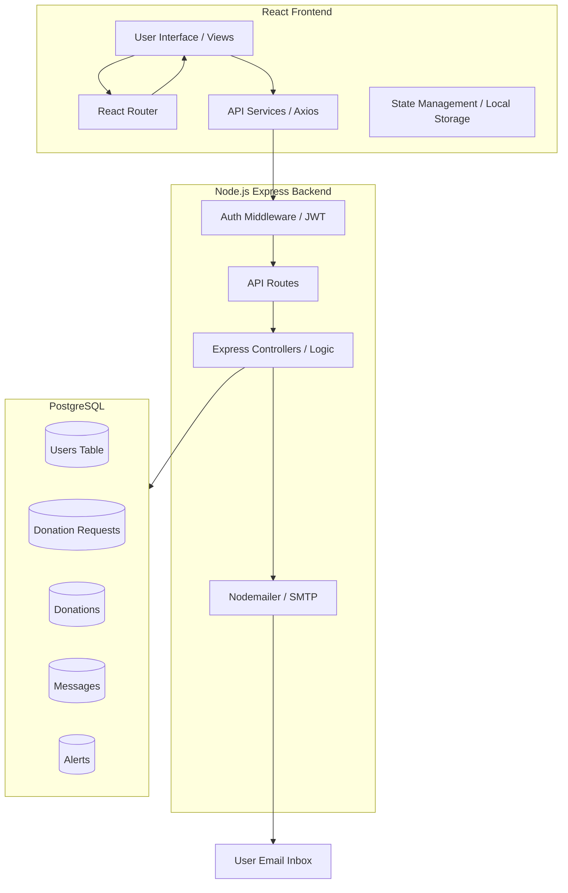
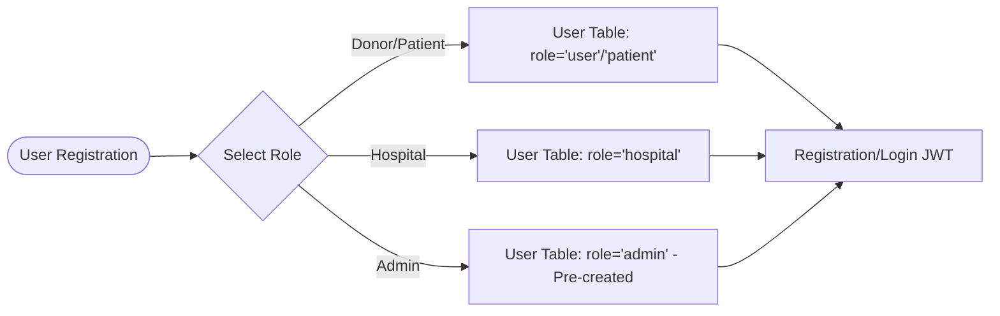
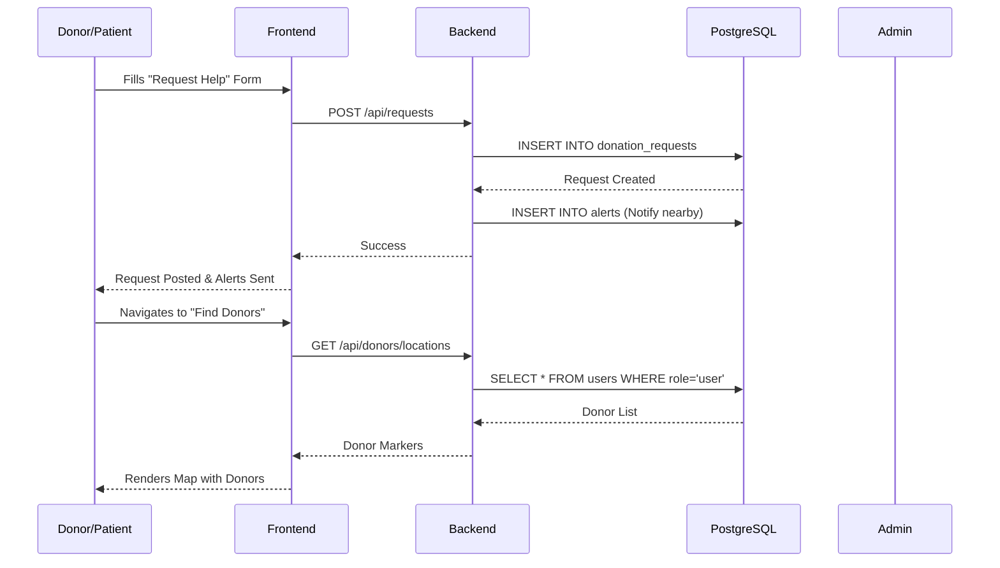
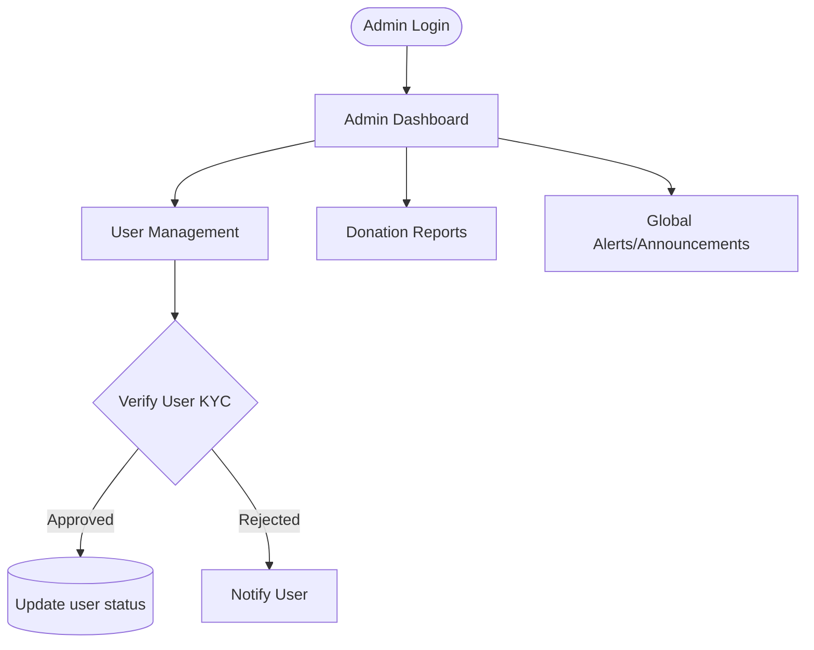

# LifeLink Project Flowchart

This flowchart outlines the architecture and core workflows of the LifeLink platform.

## System Architecture

## User Registration & Roles

## Core LifeLink Flow: Requesting & Finding Help

## Admin Oversight Flow

